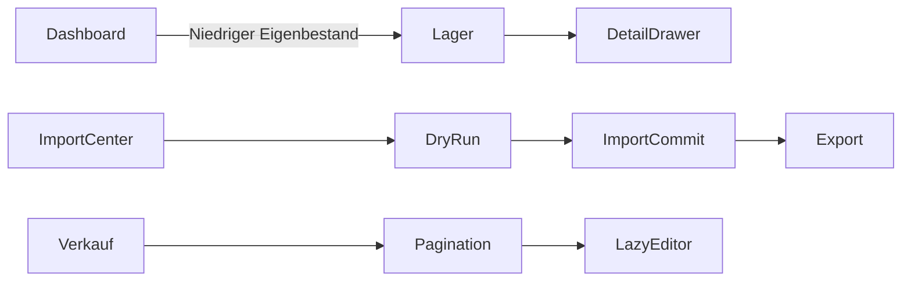

# StorageX Beta Release Gate – Dogfood Report

## Diff Summary

Release-Härtung ohne neue Fachdomäne: responsive App-Shell, konsistenter Low-Stock-Drill-down, zusätzliche Datenintegritätschecks und Performance-Härtung der Verkaufsansicht.

## Personas

- Operatives Mitglied: erfasst, filtert und bearbeitet Handelsvorgänge.
- Administrator: verwaltet Team, Stammdaten und Credentials.
- Inhaber: verantwortet Exporte, Billing und DSGVO.
- Support/QA: reproduziert Fehler ohne Tenant-Grenzen zu überschreiten.

## Kernflüsse

## Prüfmatrix

| Flow | Persona | Ergebnis | Beobachtung |
| --- | --- | --- | --- |
| Dashboard zu niedrigem Eigenbestand | Mitglied | Bestanden | 9 Hinweise führen zu 9 gefilterten Lagerzeilen |
| Einkauf bei 1280 px | Mitglied | Nach Fix bestanden | Dokument-Overflow entfernt, interner Tabellenscroll erhalten |
| Mobile Navigation | Mitglied | Bestanden | Fokusfalle, Escape und Fokus-Rückgabe korrekt |
| Lager-Drawer | Mitglied | Bestanden | Fokus und Escape korrekt |
| Produktimport | Mitglied | Bestanden | Vorlage, Mapping, Dry Run, Commit, Historie |
| Fach-/Ledgerexport | Mitglied | Bestanden | erlaubte Exporte 200 |
| Vollauszug | Mitglied | Bestanden | serverseitig 403 |
| Verkaufsbearbeitung | Mitglied | Bestanden | Lazy-Dialog öffnet mit korrekten Bestandsdaten und schließt per Escape |
| Verkaufsseite große Datenmenge | Mitglied | Nach Fix bestanden | 50 Zeilen/Seite, keine Dokumentbreite, Lighthouse 71 |

## Während des Dogfoods behobene Punkte

1. App-Shell ließ breite Tabellen das Dokument um 37 px verbreitern.
2. Dashboard-Low-Stock mischte Eigen- und Konsignationsbestand und führte auf eine abweichende Produktansicht.
3. StorageX-Metadaten enthielten einen Tippfehler und eine unnötig plattformspezifische Beschreibung.
4. Verkaufsansicht hydrierte pro Zeile ein vollständiges Bearbeiten-Formular und lud bis zu 300 Verkäufe ohne Pagination.
5. Das lokale Chrome-Trace-Profil im Repository wurde von Turbopack/Tailwind erfasst; Testprofil wurde außerhalb des Repositories verlagert und Trace-Artefakte werden ignoriert.

## Paper Cuts

- Verkaufsseite bleibt mit 50 interaktiven Zeilen merklich schwerer als das Dashboard.
- MEMBER kann den erfolgreichen OWNER-Vollauszug nicht browserseitig bestätigen.
- Next DevTools MCP ist mit Next.js 15 nicht verfügbar.

## Console und Netzwerk

Der direkte CDP-Trace enthält 1.196 Events über drei Kernseiten. Es wurden keine Console-, Runtime- oder Netzwerkfehler gefunden. Erlaubte Seiten lieferten keine unerwarteten 4xx-/5xx-Antworten.

## Human Verification

Vor öffentlichem Rollout bleiben Live-Stripe, reale E-Mail-Zustellung und Restore aus einem verwalteten Backup manuell in der Zielumgebung zu bestätigen.

## Entscheidungen

- Beta-Gate bleibt additiv; keine Schemaänderung.
- Performance wird durch Pagination und Lazy-Mount begrenzt, nicht durch das Verstecken von Datensätzen.
- Authentifizierte Trace- und Lighthouse-Artefakte werden nicht versioniert.

## Learnings

Operative Tabellen benötigen einen expliziten Render-Budget-Mechanismus. Eine reine `take`-Grenze ohne Pagination schützt zwar die Laufzeit, verliert aber Daten. Die Kombination aus serverseitiger Ansichtsfilterung, echter Trefferzahl, Pagination und lazy Zeileneditor hält sowohl Fachvollständigkeit als auch Reaktionsfähigkeit.

## Final

Keine offenen P0-/P1-Befunde. Kontrollierte Beta freigegeben; bekannte P2-/P3-Grenzen sind im Release-Bericht verlinkt.
